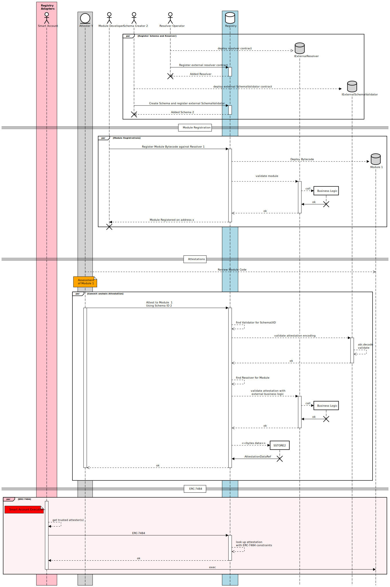

# Registry [](https://www.gnu.org/licenses/gpl-3.0)  [![Coverage][codecov-badge]][codecov] [![Foundry][foundry-badge]][foundry]

[gha]: https://github.com/rhinestonewtf/registry/actions
[gha-badge]: https://github.com/rhinestonewtf/registry/actions/workflows/ci.yml/badge.svg
[codecov]: https://codecov.io/gh/rhinestonewtf/registry
[codecov-badge]: https://codecov.io/gh/rhinestonewtf/registry/branch/main/graph/badge.svg
[foundry]: https://getfoundry.sh
[foundry-badge]: https://img.shields.io/badge/Built%20with-Foundry-FFDB1C.svg

**An attestation registry for securely using smart account modules**

The Registry is deployed at [0x000000000069E2a187AEFFb852bF3cCdC95151B2](https://contractscan.xyz/contract/0x000000000069E2a187AEFFb852bF3cCdC95151B2)

## Overview

Account abstraction (or smart accounts) will deliver three key enhancements for the Ethereum ecosystem:
improved UX, enhanced user security and greater wallet extensibility. Modular smart accounts are the next
frontier for achieving these goals. However, it also opens up a number of new challenges that
could drastically undermine the objective by opening up a plethora of new attack vectors and security concerns for accounts.

The Registry aims to solve this concern by providing a means of verifying the legitimacy and
security of independently built smart account modules for installation and use across any integrated
smart account. It allows entities to attest to statements about modules and smart accounts to query these at module installation and/or execution time. The Registry is a Singleton that is free, open and permissionless. It also serves as the reference implementation for [ERC-7484](https://eips.ethereum.org/EIPS/eip-7484).

## Core Concepts

### Attestations

Attestations on the Registry represent statements about Modules. An Attestation is made using a particular Schema that is used to encode and decode the Attestation data. The most important usecase for Attestations is to make statements about the security of a Module.

An attestation consists of two primary elements: the Schema and the
Attestation data. The Schema acts as a standardized structure for
creating and validating Attestations, defining how the Attestation data is encoded and decoded.

### Schemas

Schemas represent predefined structures utilized for the formation and
verification of Attestation data. Using flexible Schemas rather than a single, fixed Schema allows Attesters to encode their data in a custom way, providing flexibility when creating Attestations. For example, the data of an Attestation about the outcome of the formal verification on a Module will have a very format than the data of an Attestation about what interfaces a Module supports.

### Resolvers

Resolvers are external contracts that are tied to Modules and called when specific Registry actions are executed. These actions are:

- attestation
- revocation
- module registration / deployment

This architectural design aims to provide entities like Smart Account vendors or DAOs, with the
flexibility to incorporate custom business logic while maintaining the
robustness and security of the core functionalities implemented by the Registry

### Attesters

Attesters are individuals or organizations responsible for
creating and signing Attestations. They add the Attestation to the
Registry, making it available for verification.

### Modules

Modules are smart contracts that act as modular components that can be added to Smart Accounts.
The registry is agnostic towards Smart Account or Module implementations. Only Module addresses and
deployment metadata are stored on the registry.

Modules are registered on the Registry either during, using `CREATE2`, `CREATE3` or a custom deployment factory, or after deployment.

## Architecture



## Gas comparison

The following is a table of the gas differences between the Registry and a minimal [ERC-7484](https://eips.ethereum.org/EIPS/eip-7484) registry that only has one attester. As you can see, the gas difference is negligible for 1 or 2 attesters, but the Registry scales much better than using multiple single attester registries.

To run the tests yourself, run `forge test --mc RegistryGasComparisonTest -vv`.

_Note:_ The gas calculation numbers include the gas cost for `CALL`

| # of Attesters    | Registry     | Minimal7484Registry | Difference |
| ----------------- | ------------ | ------------------- | ---------- |
| 1                 | 7983         | 7706                | +277       |
| 2                 | 15472        | 15418               | +54        |
| 3                 | 20823        | 23124               | -2301      |
| n (approximation) | 5299n + 4901 | 7709n               |            |

## Using this repo

To install dependencies, run:

```bash
pnpm install
```

To build the project, run:

```bash
pnpm build
```

To run tests, run:

```bash
pnpm test
```

To run the linter, run:

```bash
pnpm lint:sol
```

## Contributing

For feature or change requests, feel free to open a PR, start a discussion or get in touch with us.

## Credits & Special Thanks

For the continuous support and constructive feedback, we would like to thank:

- [Ethereum Foundation](https://erc4337.mirror.xyz/hRn_41cef8oKn44ZncN9pXvY3VID6LZOtpLlktXYtmA)
- ERC-4337 Team
- Richard Meissner (Safe) @rimeissner
- Taek @taek.eth
- Biconomy
- Heavily inspired by EAS
