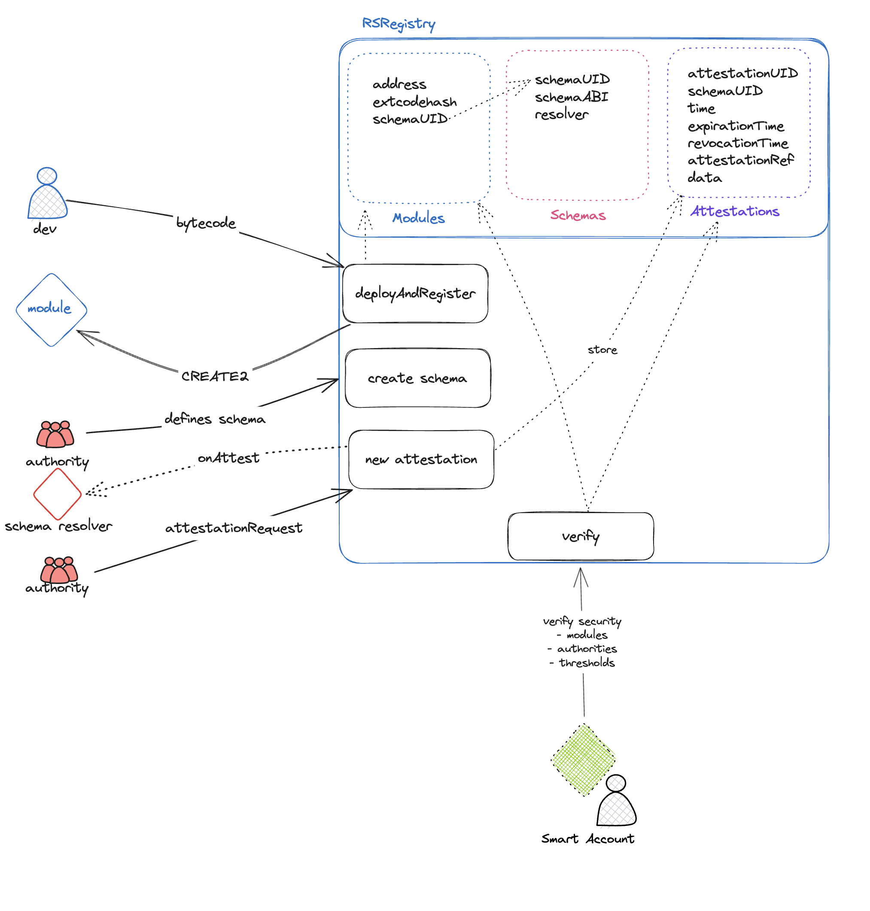

# Registry    [![Foundry][foundry-badge]][foundry]
[foundry]: https://getfoundry.sh
[foundry-badge]: https://img.shields.io/badge/Built%20with-Foundry-FFDB1C.svg

This Contract is in active development. Do not use this in Prod!

## Intro

Account abstraction (or smart accounts) will deliver three key enhancements for the Ethereum ecosystem; 
improved UX, enhanced user security and greater wallet extensibility. Modular smart accounts are the next 
frontier for supercharging these deliverables. However, it also opens up a number of new challenges that 
could drastically undermine the objective by opening up a plethora of new attack vectors and security concerns for accounts. 

The [Rhinestone Registry] aims to solve this concern by providing a means of verifying the legitimacy and 
security of independently built smart account modules for deployment and use across any integrated 
smart account. [Rhinestone Registry] is a free, open and permissionless registry and verifications 
system for smart account modules on the Ethereum platform. With an emphasis on contract security and 
transparency, it allows attesters to register, verify, and dispatch verification statuses across 
various EVM chains.

## Core Principles
### Attestations
[Attestations](./docs/Attestation.md) represent digitally documented assertions made by any entity 
about the security poture of account abstraction modules, 
serving as a seal of authenticity for the associated data. An entity known as an 
Attestor forms these records, authenticating them with their Ethereum wallet 
and then registering them on the Ethereum blockchain. The accessibility of 
these attestations for verification is universal, provided one has access 
to the Ethereum blockchain and the unique UID of the attestation.

An attestation consists of two primary elements: the schema and the 
attestation data. The schema acts as a standardized structure for 
creating and validating attestations, defining the data types, 
format, and composition. The Rhinestone Registry uses Solidity 
ABI types as acceptable fields in these schemas. The attestation 
data represents the actual information subject to attestation. 
To be classified as a valid attestation, it should adhere to the 
structure defined in the schema.

The significance of attestations lies in their ability to 
facilitate trust and credibility within the blockchain. In 
scenarios lacking physical interaction or presence, verifying 
the veracity or reliability of information can be demanding. 
Attestations address this challenge by providing third-party 
validation and a cryptographically signed confirmation of 
information authenticity, thus enhancing the information's 
trustworthiness for others.

### Schemas
[Schemas](./docs/Schema.md) represent predefined structures utilized for the formation and 
verification of attestations. They define the data types, format, and 
composition of an attestation. The Rhinestone Registry accepts Solidity 
ABI types as acceptable fields for schemas. Schemas play an essential 
role as they establish a shared format and structure for attestation 
data, enabling the creation and verification of various attestations 
in a trustless fashion. This functionality paves the way for 
interoperability and composability amongst different attestation protocols and solutions.

### Attestors
Attestors refer to individuals or organizations responsible for 
creating and signing attestations. They add the attestation to the 
Ethereum blockchain, making it available for verification. Any 
individual owning an Ethereum wallet can become an Attestor and 
can formulate attestations for a variety of purposes.

### Modules
Modules are smart contracts that act as modular components that can be added to smart accounts. 
The registry is agnostic towards smart account or module implementations. Modules addresses and 
deployment metadata are stored on the registry.

Modules are registered on the Rhinestone Registry by [deploying](./docs/ModulesRegistration.md) the Module Bytecode with `CREATE2`

### Users
Users represent entities that depend on attestations to inform 
decisions or initiate actions. They utilize the information enclosed 
within the attestation to confirm its authenticity and integrity. The 
backing for these attestations often lies in the reputation and 
trustworthiness of the Attestor.

### Ethereum ABI Types
The Ethereum Application Binary Interface (ABI) stipulates the data 
types that can be incorporated in smart contracts and other Ethereum transactions. 
EAS accepts ABI types as valid fields for schemas.

## Architecture

The Rhinestone Registry is designed as a permissionless hyperstructure. 
This architecture enables the registry to effectively manage and coordinate various types of smart contracts, 
spanning multiple developers and authorities. With this level of interconnectedness, smart contracts can freely interact with each other and with 
various authorities, opening up a world of possibilities for rich, complex interactions. It promotes a decentralized, collaborative environment, 
where entities can share, validate, and verify smart contracts across chains.

##  Changes V0.2

### New Features

* GAS Efficiency *
- GAS consumption for both storing attestations and querying the request was reduced dramatically
- non-delegated attestations can now be made without signature
- full ERC1271 support
- SSTORE2 to store attestation data
- Removal of attestation UIDs
- seperation of Schema Validation and external resolvers
- restructured files for improved readability

### Breaking Changes

Registry V0.2 introduces a major redesign and breaking changes to the regsitry code.

*Removal of Hashi / Cross-chain propagation*
While we love Hashi and believe strongly in the need of cross-chain propagation of attestations, we decided to move the propagation logic out of the registry.
The main motiviation behind this is, that cross-chain Bytecode equivalence with new 
OPCODEs will be limited. We believe a propagation implementation 
that attesters can implement as a smart account module to propagate their own attestations will be a sufficient substitute.

*Removal of Attestation UIDs*
To reduce GAS while querying / checking the registry, we redesigned the attestation storage to no longer rely on UIDs.
The chained attestation feature was removed for this redesign.

*Splitting Resolvers and SchemaValidators*
We received feature requests to allow attesters to make attestations on different schemas. 
The new version of the Registry is thus seperating resolver and schema validation into two different optional external contracts

### Prerequisites
- Solidity version 0.8.19 or later

## Contribute
For feature of change requests, feel free to get in touch with us, or open PRs

## Credits
- Rhinestone Registry is drawing some inspiration of EAS

## Authors ✨

<!-- ALL-CONTRIBUTORS-LIST:START - Do not remove or modify this section -->
<!-- prettier-ignore-start -->
<!-- markdownlint-disable -->
<table>
  <tr>
    <td align="center"><a href="http://twitter.com/zeroknotsETH/"> <b>zeroknots</b></a> <a href="https://github.com/rhinestonewtf/registry/commits?author=zeroknots" title="Code">💻</a></td>
    <td align="center"><a href="https://twitter.com/abstractooor"> <b>Konrad</b></a> <a href="https://github.com/rhinestonewtf/registry/commits?author=kopy-kat" title="Code">💻<</a> </td>
    
  </tr>
</table>
