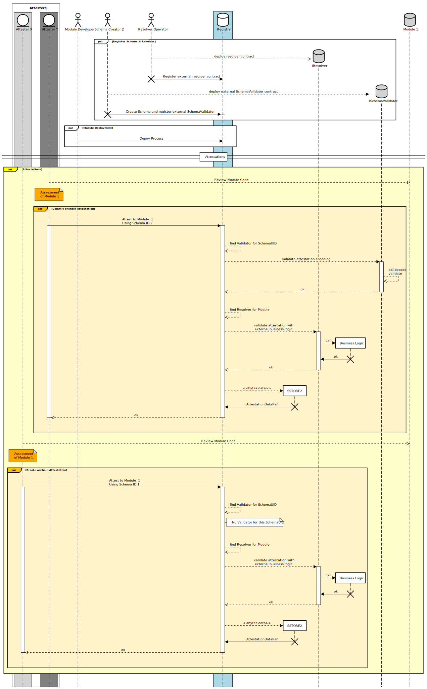

# Attestations

Attestations on the Registry represent statements about Modules. An Attestation is made using a particular [Schema](./Schemas.md) that is used to encode and decode the Attestation data. The most important usecase for Attestations is to make statements about the security of a Module.

## Attestation Lifecycle

When an Attester creates an Attestation, the Attestation data, structured according to the Schema provided by the Attester, is then added to the Registry. During the Attestation's lifecycle, the Registry can invoke hooks on the SchemaResolver during specific events like Attestation creation and revocation. This allows the SchemaResolver to ensure the integrity and correctness of the attestation throughout its lifecycle.

Inputs:

AttestationRequestData
data is `abi.encode()` according to a defined schema. The data is not stored in the storage of thr Registry, but is rather stored with `SSTORE2` to save gas and a pointer to this data is stored on the Registry.

```solidity
struct AttestationRequestData {
    address subject; // The subject of the attestation.
    uint48 expirationTime; // The time when the attestation expires (Unix timestamp).
    uint256 value; // An explicit ETH amount to send to the resolver. This is important to prevent accidental user errors.
    bytes data; // Custom attestation data.
}
```

Outputs:

AttestationRecord stored in the registry contract storage

```solidity
struct AttestationRecord {
    SchemaUID schemaUID; // The unique identifier of the schema.
    address subject; // The recipient of the attestation i.e. module
    address attester; // The attester/sender of the attestation.
    uint48 time; // The time when the attestation was created (Unix timestamp).
    uint48 expirationTime; // The time when the attestation expires (Unix timestamp).
    uint48 revocationTime; // The time when the attestation was revoked (Unix timestamp).
    AttestationDataRef dataPointer; // SSTORE2 pointer to the attestation data.
}
```



### Interactions with the SchemaValidator

Attestation data can be validated with an external contract than may to `abi.decode()` and validate all or specific fields.

### Interaction with the IResolver

Upon an Attestation's revocation, the Registry calls hooks on the associated IResolver, allowing the IResolver to update its internal state or
perform other necessary actions. This allows for extended business logic integrations.

### The Revocation Process

In the event that an Attester decides to revoke an Attestation, they issue a revocation call to the Registry. Upon receiving this call, the registry updates the revocationTime field within the attestation record. This timestamp acts as a clear indication that the attestation has been revoked, and any trust or claims that stem from it should be reconsidered.

It's important to note that apart from the revocationTime, the rest of the attestation's metadata and data remains unchanged.
Due to the nature of `SSTORE2`, all attestation data will remain onchain and thus preserves the history of attestations done.

### Editing Attestions

Attestations can not be edited. Should attestation data change, the old attestation must be revoked and a new attestation issued.

## Delegated Attestations

All Attestations leveraged within the Registry are designated as "delegated".
Such Attestations empower an entity to sign an attestation while enabling another entity to
bear the transaction cost. With these attestations, the actual Attester and the one relaying the
Attestation can be separate entities, thus accommodating a variety of use cases.
This becomes particularly beneficial when:

- A service opts to cover its users' Attestation costs (taking care of gas expenses)
- An entity wishes to execute multiple Attestations but allows the recipient or a different party to handle the transaction fees for blockchain integration.

```solidity
/**
 * @dev A struct representing the full arguments of the full delegated attestation request.
 */
struct DelegatedAttestationRequest {
    SchemaUID schemaUID; // The unique identifier of the schema.
    AttestationRequestData data; // The arguments of the attestation request.
    bytes signature; // The signature data.
    address attester; // The attesting account.
}
```

### ERC1271 Support

The Registry attestation process supports the ERC1271 standard, which allows smart contracts to implement a standard interface for contract ownership. This is particularly useful for smart account modules that are owned by a smart contract. The Registry supports the ERC1271 standard for delegated attestations.
Should the attester in the `DelegatedAttestationRequest` be a contract, a ERC1271 validation call is made.
