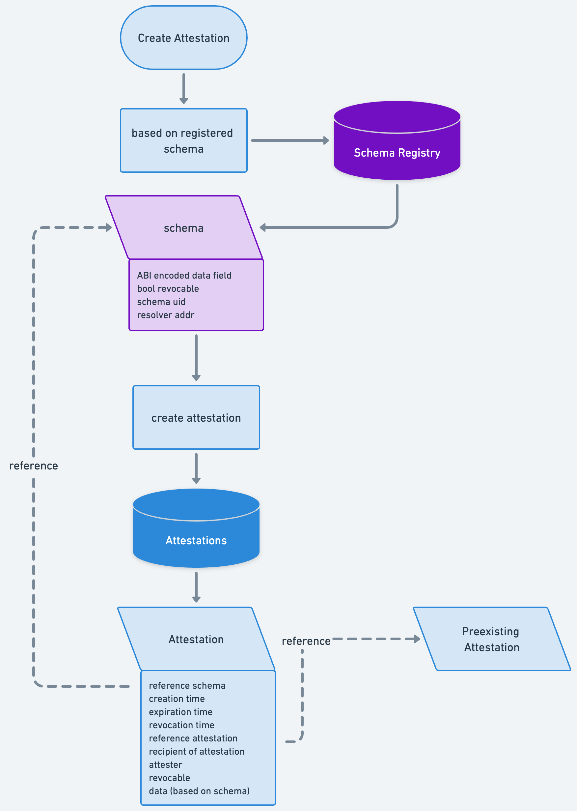

## Intro

Attestations are security guarantees or audit results that authorities commit to the registry.
These are the artifacts that smart account or users query when validating the safety of a module they want to use in their smart account.



## Specs

Attestations are made for a specific schema. The struct defines relevant metadata, while the attestation data is abi encoded in the data field. The ABI for the attestation must follow the definition of the schema.
```solidity
struct Attestation {
    bytes32 uid; // A unique identifier of the attestation.
    bytes32 schema; // The unique identifier of the schema.
    bytes32 refUID; // The UID of the related attestation.
    address recipient; // The recipient of the attestation i.e. module
    address attester; // The attester/sender of the attestation.
    uint48 time; // The time when the attestation was created (Unix timestamp).
    uint48 expirationTime; // The time when the attestation expires (Unix timestamp).
    uint48 revocationTime; // The time when the attestation was revoked (Unix timestamp).
    bool revocable; // Whether the attestation is revocable.
    bool propagateable; // Whether the attestation is propagateable to L2s.
    bytes data; // Custom attestation data.
}
```

### Chaining of attestation

To allow for complex attestation verifiction models, attestors may utilize the refUID field that references another already existing attestation UID 
Chaining of attestations can allow for complex trust delegation models.

## Verifiction of Attestations
The registry exposes a function that allows smart accounts or end users to query security attestations for a selected module.
This functionality can be called during module installation or execution.

## Challenges

Different smart accounts will have different querying needs:
- threshold of n/m authorities
- chained attestations
- revert vs return false


