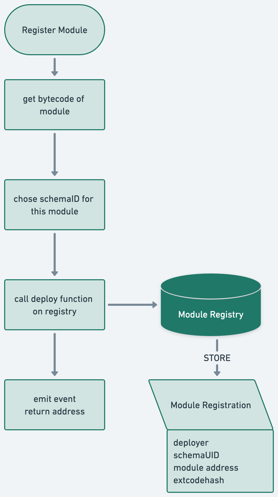

# Module Registration
The Module Registration function is used to deploy new smart account modules onto the Ethereum network. The function uses the CREATE2 opcode, allowing the contract to determine the address where the smart account module will be deployed before the actual deployment transaction is sent. The registration process requires one schema ID to be associated with the new module.

To register modules on the registry, they have to be deployed via the registry and CREATE2. 
After deploying the bytecode, the registry will save the extcodehash of the depoyed contract.
Every module is registered with a corsponding schemaUID.




After deploying the module bytecode, the registry saves the deployment address as well as the chosen `schemaId`, in addition to the following metadata.
```solidity
struct Module {
    address implementation; // The deployed contract address
    bytes32 codeHash; // The hash of the contract code
    bytes32 deployParamsHash; // The hash of the parameters used to deploy the contract
    bytes32 schemaId; // The id of the schema related to this module
    address sender; // The address of the sender who deployed the contract
    bytes data; // Additional data related to the contract deployment
}
```


