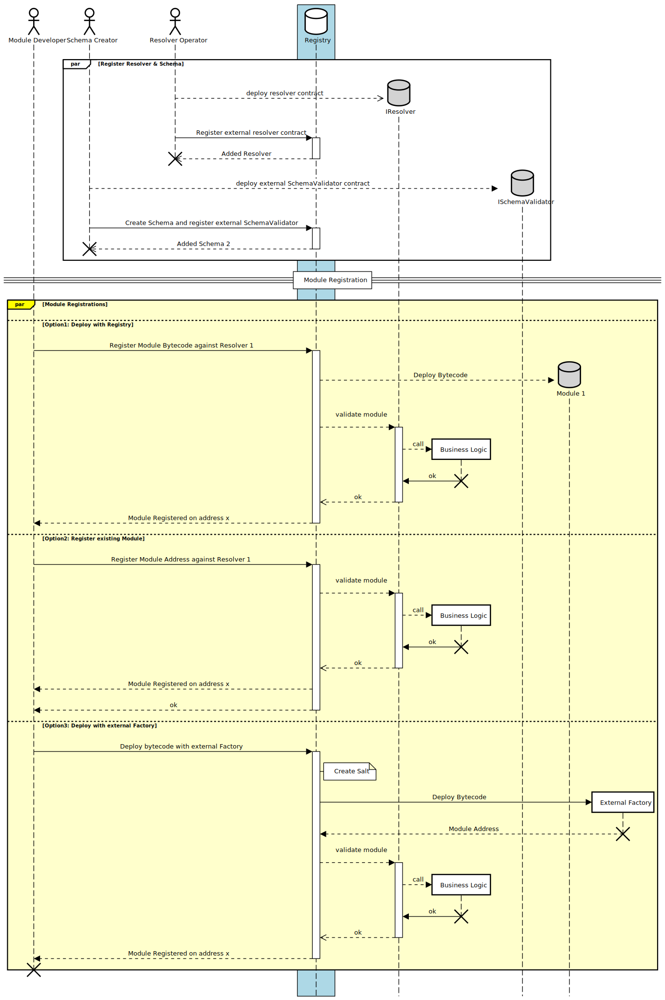

# Module Registration

In order for Attesters to be able to make statements about a Module, the Module first needs to be registered on the Registry. This can be done as part of or after Module deployment. On registration, every module is tied to a [Resolver](./Resolvers.md) that is triggered on certain registry actions.

```solidity

struct ModuleRecord {
    ResolverUID resolverUID; // The unique identifier of the Resolver
    address implementation; // The deployed contract address
    address sender; // The address of the sender who deployed the contract
    bytes data; // Additional data related to the contract deployment
}
```

## Module Deployment

The registry supports different ways to register modules:



## Deploy Bytecode via Registry (CREATE2)

Module Developers can deploy their module Bytecode directly via the registry.

```solidity
/**
 * @notice Deploys a new module.
 *
 * @dev Ensures the resolver is valid and then deploys the module.
 *
 * @param code The bytecode for the module.
 * @param deployParams Parameters required for deployment.
 * @param salt Salt for creating the address.
 * @param data Data associated with the module.
 * @param resolverUID Unique ID of the resolver.
 *
 * @return moduleAddr The address of the deployed module.
 */
function deploy(
    bytes calldata code,
    bytes calldata deployParams,
    bytes32 salt,
    bytes calldata data,
    ResolverUID resolverUID
)
    external
    payable
    returns (address moduleAddr);
```

## Deploy Bytecode via Registry (CREATE3)

Module Developers can deploy their module Bytecode directly via the registry.
The Registry also supports deployments via [CREATE3](https://github.com/0xsequence/create3)
so the initcode of the module does not affect the modules deployment address.
This feature can be very useful for cross-chain deployments.

```solidity
/**
 * @notice Deploys a new module using the CREATE3 method.
 *
 * @dev Similar to the deploy function but uses CREATE3 for deployment.
 * @dev the salt supplied here will be hashed again with msg.sender
 *
 * @param code The bytecode for the module.
 * @param deployParams Parameters required for deployment.
 * @param salt Initial salt for creating the final salt.
 * @param data Data associated with the module.
 * @param resolverUID Unique ID of the resolver.
 *
 * @return moduleAddr The address of the deployed module.
 */
function deployC3(
    bytes calldata code,
    bytes calldata deployParams,
    bytes32 salt,
    bytes calldata data,
    ResolverUID resolverUID
)
    external
    payable
    returns (address moduleAddr);

```

The `CREATE3` salt is calculated like this:

```solidity
bytes32 senderSalt = keccak256(abi.encodePacked(salt, msg.sender));

```

## Deploy Bytecode via External Factory

In order to make the integration into existing business logics possible,
the Registry is able to utilize external factories that can be utilized to deploy the modules.

```solidity
/**
 * @notice Deploys a new module via an external factory contract.
 *
 * @param factory Address of the factory contract.
 * @param callOnFactory Encoded call to be made on the factory contract.
 * @param data Data associated with the module.
 * @param resolverUID Unique ID of the resolver.
 *
 * @return moduleAddr The address of the deployed module.
 */
function deployViaFactory(
    address factory,
    bytes calldata callOnFactory,
    bytes calldata data,
    ResolverUID resolverUID
)
    external
    payable
    returns (address moduleAddr);

```

## Register an existing Module

The Registry also allows already-deployed modules to be registered. However, since it is impossible to determine the deployer post-deployment, there are two things to watch out for:

1. The Deployer can set an arbitrary Resolver
2. The address of the module deployer will be set to `address(0)`

```solidity
/**
 * @notice Registers an existing module with the contract.
 *
 * @param resolverUID Unique ID of the resolver.
 * @param moduleAddress Address of the module.
 * @param data Data associated with the module.
 */
function register(
    ResolverUID resolverUID,
    address moduleAddress,
    bytes calldata data
)
    external;

```
