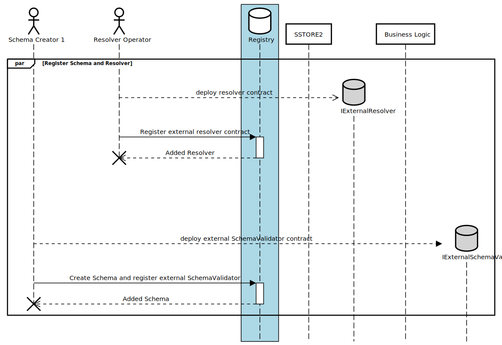

# Resolvers

This section provides a holistic overview of resolvers and their significance in the system. 
Whether you're an entity aiming to augment registry operations or a developer aiming to 
understand the potential of resolvers, this guide aims to provide the clarity you need.

## Use Cases

In the ever-evolving landscape of smart account
modularity, extensibility of the registry is paramount. Resolvers in the Registry
play a pivotal role in this regard. They stand as intermediaries or validators, 
implementing specific hooks that are invoked by the Registry during 
various critical operations:
- attestation
- revocation
- module registration / deployment

This architectural design aims to provide entities like smart account vendors or DAOs, with the 
flexibility to incorporate custom business logic while maintaining the 
robustness and security of the core functionalities implemented by the Registry

## Role of Resolveres in extending Registry functionalities
Entities utilizing the registry frequently need to extend its core functionalities 
to cater to their unique business requirements. Resolvers are the mechanisms that 
make this possible, allowing for:

- *Custom Business Logic Integration:* Entities can build upon the foundational 
registry operations by introducing complex logic sequences, tailored to their 
operational needs.

- *Security Assurance:* One of the significant advantages of using resolvers is that 
they abstract away the intricacies of attestation storage and validation. 
This abstraction ensures that the foundational security of the Registry isn't compromised, 
even when new functionalities are added.

- *Cost Efficiency in Audits:* Given that the core attestation storage and validation 
logic remains untouched, auditing becomes more straightforward and cost-effective. 
Entities can focus their audit efforts on their custom logic without the need to 
re-audit the underlying core systems.


## The IResolver interface: Standardizing Resolvers

For any entity looking to employ a resolver, adherence to a standardized 
interface is essential. The [IResolver interface](../src/external/IResolver.sol) delineates the essential 
functions a resolver must implement to ensure seamless integration and operation with the registry.


## Example Resolvers and Custom Development

To kickstart the process for developers and entities, the repository furnishes several example 
resolvers. These serve as templates, guiding developers on how resolvers can be crafted and 
highlighting the potential of what can be achieved. By utilizing these example resolvers as a 
base, developers can modify, enhance, and create intricate resolvers tailored to specific needs, 
without the necessity to start from scratch.

- [Simple Resolver](../src/external/examples/SimpleValidator.sol)
- [Value Resolver](../src/external/examples/ValueResolver.sol)
- [Token Resolver](../src/external/examples/TokenizedResolver.sol)


## Adding a Resolver to the Registry

The registry exposes the following functions to register and manage resolvers:
```solidity
/**
 * @notice Registers a resolver and associates it with the caller.
 * @dev This function allows the registration of a resolver by computing a unique ID and associating it with the schema owner.
 *      Emits a SchemaResolverRegistered event upon successful registration.
 *
 * @param _resolver Address of the IResolver to be registered.
 *
 * @return uid The unique ID (ResolverUID) associated with the registered resolver.
 */

function registerResolver(IResolver _resolver) external returns (ResolverUID);

/**
 * @notice Updates the resolver for a given UID.
 *
 * @dev Can only be called by the owner of the schema.
 *
 * @param uid The UID of the schema to update.
 * @param resolver The new resolver interface.
 */
function setResolver(ResolverUID uid, IResolver resolver) external;
```


After storing the resolver on the registy, a ResolverUID is emited, that Module Developers can utilize to register Modules.

```solidity
struct ResolverRecord {
    IResolver resolver; // Optional schema resolver.
    address schemaOwner; // The address of the account used to register the schema.
}
```

## Sequence Diagram


