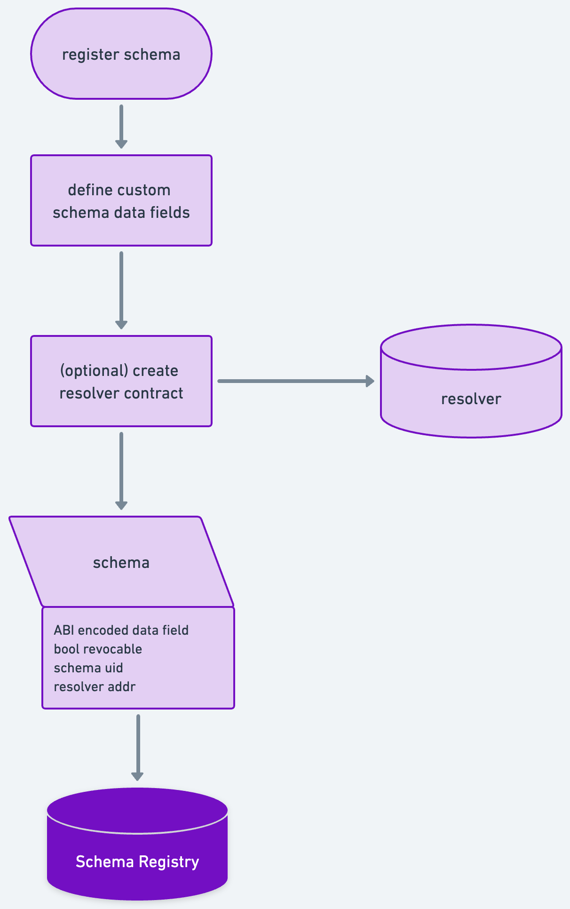

## Intro
Any module / plugin registered in the RSRegistry uses one schema.



## Challenges

Different authorities may chose d ifferent data points that are relevant for their ecosystem. 
To allow dynamic attetation data fields, we suggest to leverage an EAS-like schema registration system.

## Specs

Schema can hold a string encoded ABI describtion that defines the data fields for attestations done against this schema.

```solidty
struct SchemaRecord {
    bytes32 uid; // The unique identifier of the schema.
    ISchemaResolver resolver; // Optional schema resolver.
    bool revocable; // Whether the schema allows revocations explicitly.
    string schema; // Custom specification of the schema (e.g., an ABI).
}
```

### Resolvers / Schema owners
When registering a schema, a resolver contract can be specified. 
This contract exposes hooks that will be called during the attestation and revocation process.
The resolver may implement any logic to extend the attestation and revocation process.


When calling the `registerSchema` function on the [Registry], the following parameters are required:

```solidity
function registerSchema(
    string calldata schema,
    ISchemaResolver resolver,
    bool revocable
)
    external
    returns (bytes32);
```

After a successful schema registry, the [Registry] will return a unique identifier for the schema. This identifier can be used to reference the schema in future operations.

```solidity
struct SchemaRecord {
    bytes32 uid; // The unique identifier of the schema.
    ISchemaResolver resolver; // Optional schema resolver.
    bool revocable; // Whether the schema allows revocations explicitly.
    string schema; // Custom specification of the schema (e.g., an ABI).
    address schemaOwner; // The address of the account used to register the schema.
}
```

## Schema Resolver

The SchemaResolver plays a vital role in the [Registry]'s infrastructure, serving as a conduit for verifying and managing the attestations related to each registered schema. Essentially, the SchemaResolver is an interface definition that interacts with the [Registry] to register schemas and control how attestations are formed and validated.

Entities that register schemas on the registry elect to provide a SchemaResolver. During attestations, revocations, and module registrations, the registry calls hooks on the provided SchemaResolver, allowing it to act on the associated operations. This interaction empowers the SchemaResolver to govern the integrity and correctness of the attestations.

### Functionality

A SchemaResolver is associated with a particular schema at the time of schema registration. The SchemaResolver provides an interface for the [Registry] to interact with the schema, specifically to encode, decode, and verify the attestation data against the schema. This ensures that the data being attested is in line with the schema and can be correctly interpreted by anyone accessing the attestation.

### Responsibilities

The primary responsibilities of the SchemaResolver include:

-   **Validation:** The SchemaResolver is responsible for ensuring that all attestations adhere to the associated schema. It performs validation on the data being attested, ensuring that it meets the requirements specified in the schema.
-   **Encoding and Decoding:** To manage the storage and retrieval of attestations, the SchemaResolver must be able to correctly encode and decode attestation data according to the schema. This enables the data to be stored compactly on-chain, while still maintaining its meaningfulness off-chain.
-   **Hook Calls:** During certain operations such as attestations, revocations, and module registrations, the [Registry] will call hooks on the SchemaResolver. These hooks allow the SchemaResolver to perform any necessary actions related to these operations. For example, an attestation hook might perform additional checks on the data or update some internal state.

### Extensibility

The SchemaResolver provides a extensibility to the [Registry]. By allowing entities to provide their own SchemaResolver when registering a schema, the [Registry] can support a wide variety of data formats and validation rules. This extensibility makes the [Registry] versatile enough to support the diverse needs of different smart account modules.

    ```
	The SchemaResolver is a critical component of the [Registry], ensuring data integrity and consistency throughout the
	system. It guarantees that the data being attested meets the necessary validation criteria, while also maintaining a
	level of extensibility, thus enhancing the system's overall flexibility and robustness.
    ```

### Example: TokenResolver

The TokenResolver is a resolver contract used for schema resolution that verifies if a designated quantity of tokens have received approval for attestation. Upon submission of an attestation, the resolver oversees the necessary token transfer from the address of the attester to its own address. This contract makes use of both the ERC20 standard and the SafeERC20 library to ensure safe and secure transfer of tokens.

```solidity
contract TokenizedResolver is SchemaResolver {
    using SafeERC20 for IERC20;

    IERC20 private immutable token;

    uint256 immutable fee = 10;

    constructor(address rs, address tokenAddr) SchemaResolver(rs) {
        token = IERC20(tokenAddr);
    }

    function onAttest(
        Attestation calldata attestation,
        uint256 value
    )
        internal
        virtual
        override
        returns (bool)
    {
        // Transfer attestation fee to from attester to resolver
        token.safeTransferFrom(attestation.attester, address(this), fee);
        return true;
    }

    function onRevoke(
        Attestation calldata attestation,
        uint256 value
    )
        internal
        virtual
        override
        returns (bool)
    {
        return true;
    }

    function onModuleRegistration(
        Module calldata module,
        uint256 value
    )
        internal
        override
        returns (bool)
    {
        return true;
    }

    function onPropagation(
        Attestation calldata attestation,
        address sender,
        address to,
        uint256 toChainId,
        address moduleOnL2
    )
        internal
        override
        returns (bool)
    {
        return true;
    }
}
```

### Example: ValueResolver

The ValueResolver contract is a straightforward schema resolver that verifies whether a precise amount of ETH has been included with an attestation. During the formation of the contract, a goal value is established. Throughout the attestation procedure, it assures that the inputted value aligns with this previously defined target value. If there's a match, the attestation is deemed valid.

```solidity
contract ValueResolver is SchemaResolver {
    uint256 immutable fee = 10;

    constructor(address rs) SchemaResolver(rs) { }

    function onAttest(
        Attestation calldata attestation,
        uint256 value
    )
        internal
        virtual
        override
        returns (bool)
    {
        return msg.value > fee;
    }

    function onRevoke(
        Attestation calldata attestation,
        uint256 value
    )
        internal
        virtual
        override
        returns (bool)
    {
        return true;
    }

    function isPayable() public pure override returns (bool) {
        return true;
    }

    function onModuleRegistration(
        Module calldata module,
        uint256 value
    )
        internal
        override
        returns (bool)
    {
        return true;
    }

    function onPropagation(
        Attestation calldata attestation,
        address sender,
        address to,
        uint256 toChainId,
        address moduleOnL2
    )
        internal
        override
        returns (bool)
    {
        return true;
    }
}
```


### Registration of Schemas across L2s

The schemaUID is generated using the schema definition as well as the schemaOwner (sender of the schema registration request)
it is important that these parameters are reused across chains to ensure that attestations propagated across chains are compatible

```solidity
function _getUID(SchemaRecord memory schemaRecord) private pure returns (bytes32) {
    return keccak256(
        abi.encodePacked(schemaRecord.schema, schemaRecord.schemaOwner, schemaRecord.revocable)
    );
}
```
